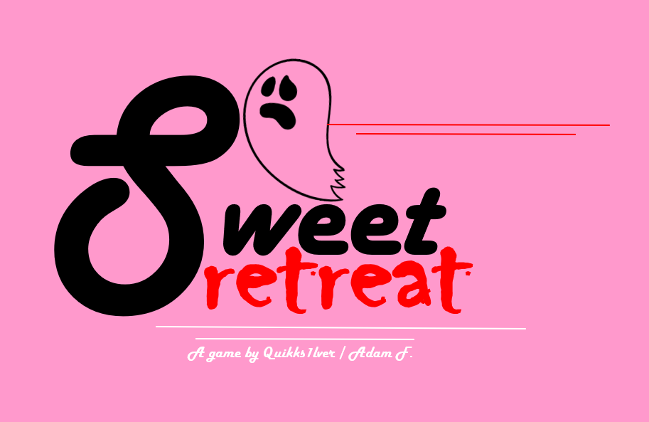

## 👻 Sweet Retreat 🍪
#### My first videogame: A 2-D action sidescroller, powered by Pygame

### How to Play
1. [Install python3](https://www.python.org/downloads/)
2. ``git clone`` the repo, or download a ``.zip`` file
3. In the ``sweet-retreat/`` directory, run ``pip install -r requirements.txt``
4. Run ``python3 main.py`` to play